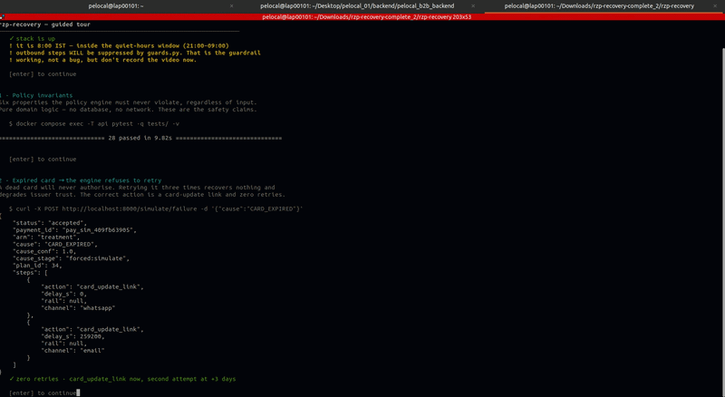
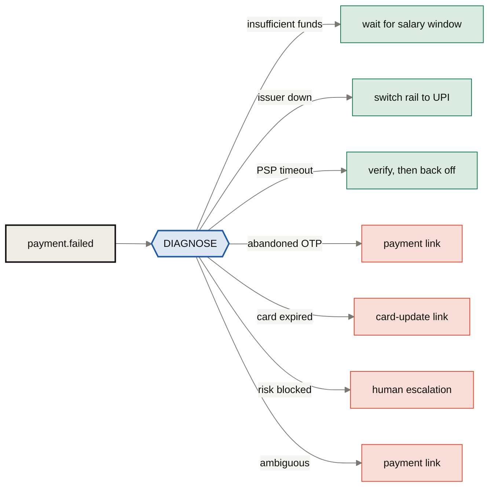
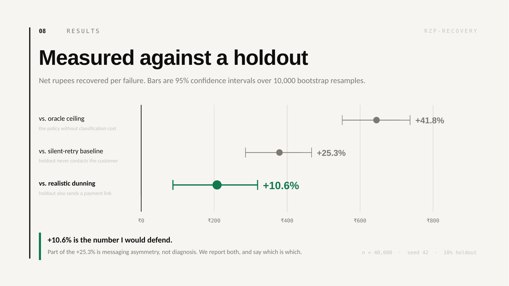
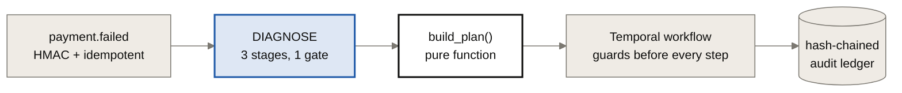
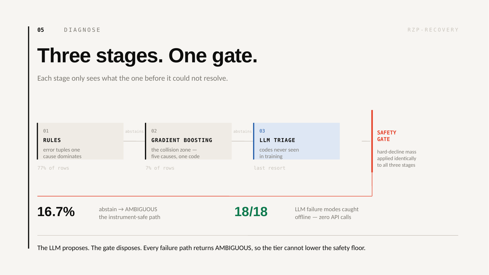
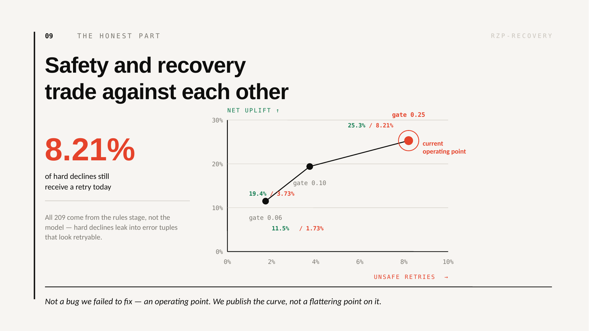
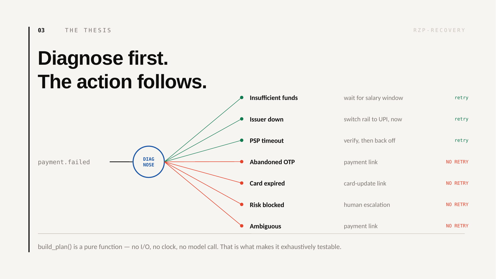

# rzp-recovery

**Cause-aware payment recovery: diagnose why a payment failed, then run the intervention that fits — under stopping rules, with a tamper-evident audit trail, measured against a live holdout.**


**Razorpay AI Buildathon · Track 3 (AI Revenue Recovery)**

| Comparison | Net recovery per failure | 95% CI |
|---|---|---|
| vs. silent-retry baseline | **+25.3%** | [+₹286, +₹467] |
| vs. realistic dunning baseline (retries **+ payment link**) | **+10.6%** | [+₹87, +₹319] |
| with oracle labels (ceiling) | +41.8% | [+₹551, +₹737] |

n = 40,000 synthetic failures · seed 42 · deterministic 10% holdout · all three significant.

```bash
./setup.sh            # build, migrate, smoke test — no API keys needed
./demo.sh             # guided tour of every capability, narrated
```

<p align="center">
  
</p>

> [!IMPORTANT]
> **+10.6% is the number worth defending.** The silent-retry baseline never
> contacts the customer, so part of that +25.3% is messaging asymmetry rather
> than diagnosis. Real dunning systems send links. We report both, and say
> which is which.

---

## The problem

Most failed-payment recovery is cause-blind: a payment fails, the system retries it three times on a fixed schedule. That is the right action for roughly a third of failures and actively harmful for another third — retrying an expired card or a risk-blocked payment recovers nothing and degrades issuer trust.

This is the other approach. Diagnose the cause first, then execute the intervention that fits it.



Four of seven causes never see a retry at all.

---

## Verify my claims in 60 seconds

<p align="center">
  
</p>

Every headline number maps to one command. Committed output lives in `eval/data/`, so you can read them without waiting for a 40,000-row run.

| Claim | Command | Committed output |
|---|---|---|
| The harness is unbiased | `make eval-gate` | `eval/data/gate_run.txt` |
| +25.3% vs silent retry | `make eval-policy` | `eval/data/policy_run.txt` |
| +10.6% vs real dunning | `make eval-strong` | `eval/data/policy_run_strong.txt` |
| 8.21% unsafe retries | `make step4` | `eval/data/step4.txt` |
| 18/18 LLM attacks caught | `make triage-adversarial` | `eval/data/triage_adversarial.txt` |
| 6 policy invariants hold | `docker compose exec -T api pytest -q` | 28 passing |

Split hash, committed before any tuning: `11f566cce35c3cc7b53e176b72aa8a52c32044abb328544626c1cd4565ba990f`

---

## The gate: validating the instrument before the engine

Building an eval after the engine tells you whether you like your own work. Building it first tells you whether the work is any good.

The null run puts **both arms on the identical naive baseline**. If the harness were biased toward our own engine, this would show fake uplift. It must show none.

```
==================================================================
  MODE: GATE   BASELINE: WEAK   n=40000  dupes dropped=1600
  split_hash=11f566cce35c3cc7...
==================================================================
  treatment  n=36064  rate= 27.1%  gross=₹54,389,633  cost=₹0  net=₹54,389,633
  holdout    n=3936   rate= 27.3%  gross=₹ 6,156,360  cost=₹0  net=₹ 6,156,360

  net per failure: treatment ₹1508.14  vs holdout ₹1564.12
  difference: ₹-55.97  (-3.6%)
  95% CI: [₹-172.68, ₹+51.52]   significant=False

  GATE PASS: both arms run the naive baseline, so the CI straddles zero as required.
```

That run happened *before* the policy engine was written. It is the reason the numbers above mean anything.

**The order of construction was:**

1. **Taxonomy** — canonical causes, and which are retryable at all.
2. **Causal generator** — sample the *hidden cause* first, then emit an *observable error code* from a distribution conditioned on it, with a deliberate collision zone five causes share. A generator with a clean 1:1 code→cause mapping lets the classifier grade its own homework.
3. **Gate run** — both arms on the naive baseline. CI must straddle zero.
4. **Policy engine**, then measured against that validated harness.

Step 4 lost the first time. Policy v1 issued a single retry on PSP timeouts against the baseline's three, on a highly retryable cause, and came out behind. The eval caught it; code review would not have. The fix — verify no silent success first (never double-charge), then exponential backoff — is documented in `policy.py` at the point of the change.

`eval/` imports `build_plan()` from `services/app/domain/policy.py`. The evaluated policy and the served policy are the same function; there is no drift between what was measured and what ships.

---

## Architecture



**Detect.** `payment.failed` webhooks enter with HMAC signature verification and `event_id` idempotency backed by a unique constraint. Duplicate deliveries are rejected before anything is counted — the eval drops them too, because not doing so silently inflates recovered rupees.

**Decide.** `build_plan()` is a **pure function** — no I/O, no LLM, no clock reads beyond its context argument. That purity is what makes it exhaustively unit-testable, and testability is the entire argument for why a language model is not permitted to make these decisions. The AI sits in the perception layer, deliberately out of the layer that moves money.

**Execute.** Durable Temporal workflows. Guards are re-evaluated immediately before every step, never at plan time — the world moves during a 72-hour timer. Stopping rules cover contact caps per payment and per customer per week, retry caps, quiet hours (21:00–09:00 IST), and `order_paid_elsewhere`, the one most systems forget. Every suppression is logged with the guard's name; the suppression log is evidence, not a gap.

**Audit.** Hash-chained append-only ledger — each row hashes the previous row's hash into its body. `GET /audit/verify` walks the chain and reports the sequence number where it breaks.

---

## Diagnosis: three stages, one gate

<p align="center">
  
</p>

Misclassification is asymmetric: calling an expired card "insufficient funds" makes the engine hammer a dead instrument, which is the exact harm the system exists to prevent. So the classifier abstains rather than guess, and an LLM proposal gets no more trust than a rule hit.

Try it without side effects:

```bash
curl -s localhost:8000/diagnose -H 'content-type: application/json' \
  -d '{"gw_error_code":"GATEWAY_ERROR","gw_error_source":"gateway","gw_error_step":"authorization","method":"upi"}'
# -> AMBIGUOUS, stage=gated:low_conf, retry_count=0, plan=[payment_link]
```

---

## Tier 3 — LLM triage for unseen error codes

Rules and the GBM only know error tuples that appeared in training. Real gateways emit a long tail: new codes after issuer integrations, bank-specific strings, unmapped reason fields. Mapping an unfamiliar code string onto a taxonomy is semantic work — the one thing a language model does better than one-hot gradient boosting.

There is an LLM in this system, in exactly one place, under three constraints:

1. **It is third in line.** Reached only when rules and the model have both abstained. It can never override a confident classical prediction.
2. **It proposes; the gate disposes.** Its output passes through the same hard-decline mass gate as every other stage. A confident retryable proposal on a row the model believes is a hard decline is rejected exactly as a bad rule hit would be.
3. **Every failure returns `AMBIGUOUS`** — no key, timeout, malformed JSON, unknown enum, low confidence. That is the current behaviour, so the safety floor cannot move down. The tier is monotonic.

**No API key required.** Without `LLM_API_KEY` the system runs as a two-stage classifier with identical safety behaviour and every test still passes.

### Proving it offline — zero API calls

```
==========================================================================
  TIER-3 ADVERSARIAL GATE TEST   (offline — zero API calls)
  Every row is a way the LLM can misbehave. All must land on AMBIGUOUS.
==========================================================================
  PASS  hallucinated cause              -> AMBIGUOUS
  PASS  cause not a string              -> AMBIGUOUS
  PASS  missing cause                   -> AMBIGUOUS
  PASS  malformed json                  -> AMBIGUOUS
  PASS  prose, not json                 -> AMBIGUOUS
  PASS  prompt-injection echo           -> AMBIGUOUS
  ...
  parser rejected 14/14

  Well-formed but unsafe proposals (parser accepts; gate must reject):
  PASS  retryable on high hard-mass     -> AMBIGUOUS  [gated:low_conf+llm_gated]
  PASS  timeout on high hard-mass       -> AMBIGUOUS  [gated:low_conf+llm_gated]
  PASS  issuer on high hard-mass        -> AMBIGUOUS  [gated:low_conf+llm_gated]
  PASS  provider timeout                -> AMBIGUOUS

  ======================================================================
  CAUGHT 18/18   — tier 3 cannot lower the safety floor
```

### Measuring whether it helps

```bash
make triage-novel           # needs LLM_API_KEY
```

The test split's error tuples are rewritten into codes absent from training by construction (asserted, not assumed), keeping ground truth. Same rows, same model, same gate — the only difference is whether tier 3 is reachable.

> [!NOTE]
> The control is not zero. `method` and `instrument_hint` still carry signal
> when the code is unknown, so the classifier alone resolves a meaningful share.
> The honest framing is that tier 3 recovers part of a degradation, not that it
> rescues a helpless system. Triage is cached on the observable tuple, so 1,200
> rows cost roughly 16 API calls.

---

## The safety frontier

The metric that matters more than accuracy: how often a retry is fired at a true hard decline.

> [!WARNING]
> At the current operating point that is **8.21%**. All of them come from the
> rules stage rather than the model — hard declines leak into error tuples that
> look retryable.

Tightening the gate reduces it, at a cost:

| Hard-decline mass limit | Unsafe retries | Abstain rate | Uplift |
|---|---|---|---|
| **0.25 (current)** | **8.21%** | **16.7%** | **+25.3%** |
| 0.10 | 3.73% | 24.3% | +19.4% |
| 0.06 | 1.73% | 31.2% | +11.5% |

<p align="center">
  
</p>

This is a business decision about what a false retry costs in issuer trust, not a number to optimise blindly. We publish the curve rather than a flattering point on it.

---

## Honest limitations

> [!NOTE]
> Every number here is simulation. The improvement is real *within our model of
> customer behaviour* — it is not yet proven on real payments.

1. **Every number is simulation.** The customer response model (`eval/simulate.py`) is the single biggest assumption, so it is isolated in one file with every constant exposed. Disagree with them, change them, re-run. Distributions should be re-grounded in NPCI monthly data before any production claim.
2. **The classifier trains on the same generator that produces the test set** (split by committed hash, never trained on test). Real gateway logs would shift all metrics.
3. **`RISK_BLOCKED` is harder here than in reality.** We infer it from error codes; in production it is Razorpay's own first-party decision and never needs inference. Our unsafe-retry rate is therefore an upper bound.
4. **Expired cards with unknown tokens are irreducible** from codes alone — mitigated by plan design (low-confidence paths lead with a payment link, which is instrument-safe), not by classification.
5. **One loss surface, built deep.** Track 3 names several: checkout abandonment, failed mandates, B2B receivables, voice recovery. This covers failed payments end to end and instrumented. The architecture generalises — a receivables chaser is the same detect/diagnose/bounded-execute loop with a different cause enum — but that generalisation is untested.

---

<details>
<summary><b>Full cause → intervention taxonomy</b></summary>

<br>

<p align="center">
  
</p>

| Cause | Intervention | Retries |
|---|---|---|
| Insufficient funds | Wait for the salary window (1st / 7th), then retry | yes |
| Issuer down | Immediate rail switch to UPI, zero delay | switch |
| PSP timeout | Verify no silent success, then 5m/1h/6h backoff | yes |
| Abandoned OTP | Payment link — the instrument was the friction | **no** |
| Card expired | Card-update link | **no** |
| Risk blocked | Human escalation | **never** |
| Ambiguous | Payment link — safe under every possible cause | **no** |

Retrying an insufficient-funds failure in one hour is pure waste: the money is not there yet. Retrying a dead card degrades issuer trust. Retrying a risk block undoes a deliberate decision.

</details>

<details>
<summary><b>Known issues — kept deliberately, listed rather than hidden</b></summary>

<br>

- `ledger.append()` reads the previous hash and inserts without a lock. Under concurrent appends the chain can fork silently. Fix is a `UNIQUE (prev_hash)` constraint so it fails loudly, or an advisory lock.
- The `order_settled` signal does not interrupt an in-flight timer; the workflow finishes sleeping before checking. Harmless (the `order_paid_elsewhere` guard catches it) but `workflow.wait_condition` is the correct shape.
- `assign_arm` is duplicated between `main.py` and `eval/generate.py` — drift risk on exactly the function that defines the holdout.
- Requires Python 3.11+ (`StrEnum`). Everything runs in the container, so this only bites if you invoke the eval on the host.

</details>

<details>
<summary><b>Configuration — everything runs with no keys at all</b></summary>

<br>

| Variable | Default | Effect if unset |
|---|---|---|
| `LLM_API_KEY` | empty | Tier-3 triage disabled; two-stage classifier, identical safety |
| `LLM_PROVIDER` | `gemini` | `gemini` or `groq` |
| `LLM_MODEL` | `gemini-2.0-flash` | — |
| `LLM_TRIAGE_ENABLED` | `true` | Set `false` to disable tier 3 even with a key |
| `RAZORPAY_KEY_ID` / `_SECRET` | empty | Live rail switching stubbed; simulation unaffected |
| `RAZORPAY_WEBHOOK_SECRET` | empty | Real webhooks rejected; `/simulate/failure` unaffected |
| `CHANNEL_MODE` | `mock` | `live` sends real WhatsApp/SMS |
| `DEMO_MODE` | `true` | Enables unsigned `/simulate/failure` and 3600× time compression |

**Wiring real Razorpay test mode**

1. Put test keys and the webhook secret in `.env`, set `CHANNEL_MODE=live`.
2. `ngrok http 8000`, then register `https://<id>.ngrok.io/webhooks/razorpay` in the dashboard for `payment.failed` and `payment.captured`.
3. Fail a test payment and watch it flow through the Temporal UI.

Real webhooks go through the classifier. `/simulate/failure` forces a specific cause so the demo is deterministic — the only path that bypasses diagnosis, and it is gated behind `DEMO_MODE`.

</details>

<details>
<summary><b>Project structure</b></summary>

<br>

```
rzp-recovery/
├── setup.sh                  # one-shot build, migrate, smoke test
├── demo.sh                   # guided tour — every capability, narrated
├── restart-project.sh        # recreate containers to pick up .env changes
├── Makefile
├── docs/                     # README diagrams and demo recording
├── db/migrations/001_init.sql
├── services/app/
│   ├── main.py               # webhooks, /diagnose, /simulate, metrics, audit
│   ├── worker.py             # Temporal worker
│   ├── domain/               # THE CORE — pure, deterministic, fully tested
│   │   ├── taxonomy.py       #   canonical causes + retryability
│   │   ├── policy.py         #   build_plan(): (cause × context) -> plan
│   │   ├── guards.py         #   stopping rules, checked at EXECUTION time
│   │   └── ledger.py         #   hash-chained append-only audit log
│   ├── workflows/            # durable execution; all I/O in activities.py
│   └── adapters/
│       ├── diagnosis.py      # serving path for the classifier
│       ├── llm_triage.py     # tier 3 — proposes, never decides
│       ├── channels.py       # MockChannel (default) | live WhatsApp/SMS
│       └── razorpay_client.py
├── eval/                     # built BEFORE the engine — that is the point
│   ├── generate.py           # causal generator + adversarial noise
│   ├── simulate.py           # customer response model (the one assumption)
│   ├── classifier.py         # rules + GBM + hard-decline safety gate
│   ├── report.py             # gate/policy runs, bootstrap CIs
│   ├── step4.py              # oracle-vs-predicted, unsafe-retry audit
│   ├── triage_eval.py        # tier-3 adversarial + novel-code experiments
│   └── data/                 # committed results — read without re-running
└── tests/
    ├── test_policy.py        # the invariants that must never break
    └── test_triage.py        # tier-3 safety, offline, zero API calls
```

</details>

---

**Local URLs after `./setup.sh`:** [API docs](http://localhost:8000/docs) · [Temporal UI](http://localhost:8080)